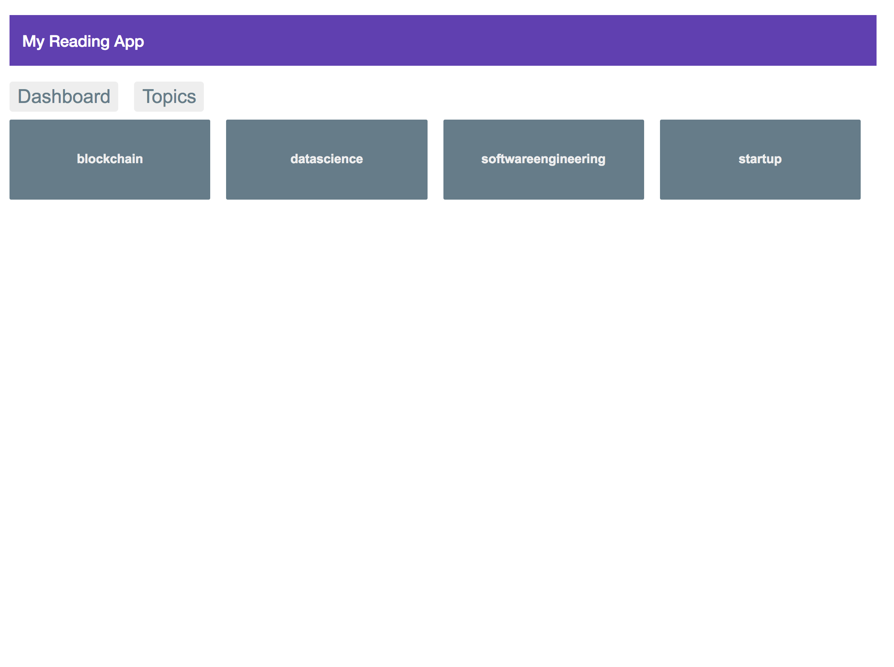
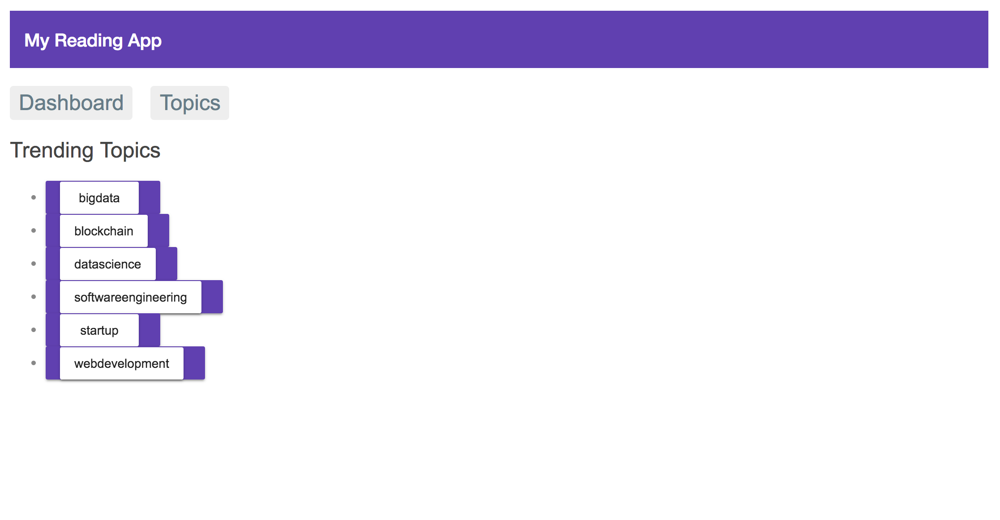
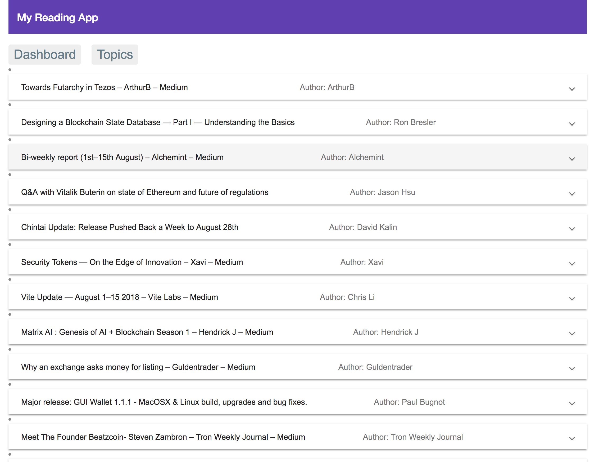

# Medium Recommender Project

## Install Requirements:
* Install Node.js
* Install MongoDB
* Create conda environment for mediumScrapder

```
conda create env -n medium
source activate medium
conda install -c conda-forge scrapy
conda install pymongo
```

## Running the Scraper:
* Start mongodb

```
mongod --dbpath ~/data/db
```

* Start Scraper in a different window

```
cd medium/mediumScrapder
scrapy crawl my_scraper -o sample.jl -a tag='datascience' -a date='2018/01/01/'
```

## Web App Install Requirements:
```
npm install -g @angular/cli
cd my-medium-app
ng serve
```

## App Snapshots
 * Dashboard View:


 * Topics View:


 * Articles View:

